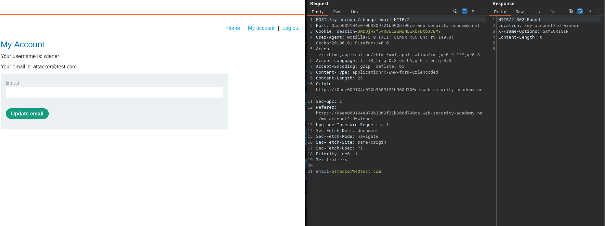
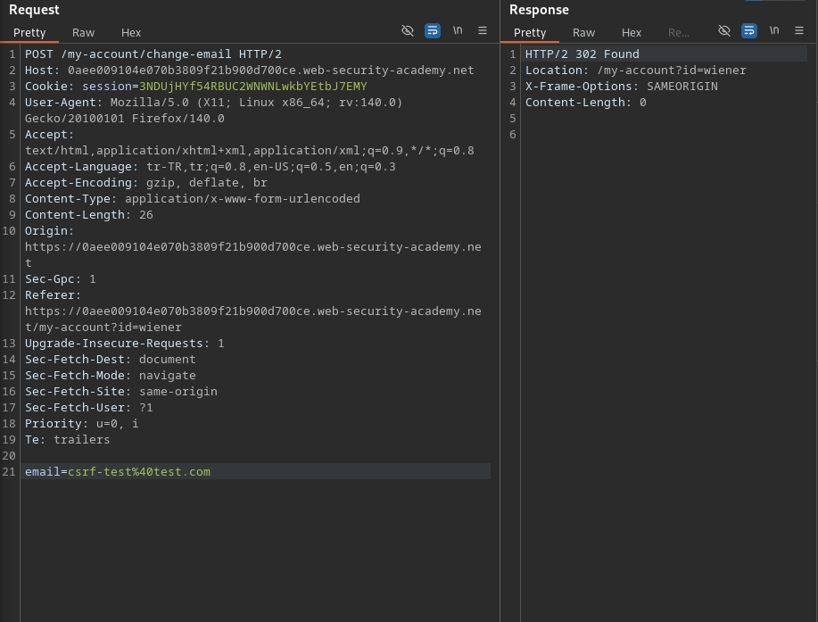
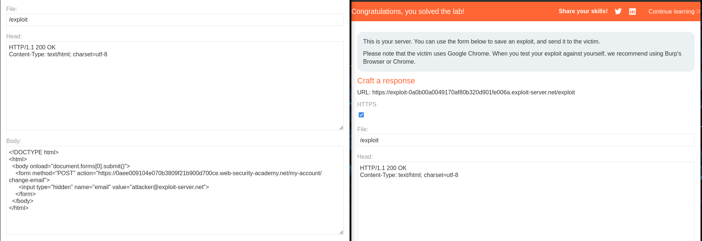

# Lab: CSRF vulnerability with no defenses

## Lab Description

This lab's email change functionality is vulnerable to CSRF.

To solve the lab, craft some HTML that uses a CSRF attack to change the viewer's email address and upload it to your exploit server.

You can log in to your own account using the following credentials: wiener:peter 

---

## Step 1 — Analyze Email Change Functionality

After logging in as a valid user, the email change functionality was tested
from the account settings page.

When a new email address was submitted, an HTTP request was generated
to update the user's email address.
The request was captured using Burp Suite for further analysis.

---

## Step 2 — Confirm Lack of CSRF Protection

The email change request was reviewed to identify any CSRF protections.
No CSRF token or anti-forgery parameter was present in the request.

The request was replayed using Burp Repeater with a modified email address.
The server accepted the request and updated the email successfully.

This confirms that the functionality relies solely on the user's session
cookie and does not implement any CSRF defenses.

---

## Step 3 — Exploit CSRF via Malicious HTML Page

Since the email change functionality does not implement any CSRF defenses,
a malicious HTML page was crafted to perform the request automatically.

The following HTML form submits a POST request to the email change endpoint
as soon as the page is loaded:

<!DOCTYPE html>
<html>
  <body onload="document.forms[0].submit()">
    <form method="POST" action="https://LAB-ID.web-security-academy.net/my-account/change-email">
      <input type="hidden" name="email" value="attacker@exploit-server.net">
    </form>
  </body>
</html>

The HTML was uploaded to the exploit server and executed in the victim’s browser while authenticated.
As a result, the victim's email address was changed without their consent,
successfully solving the lab.

---

