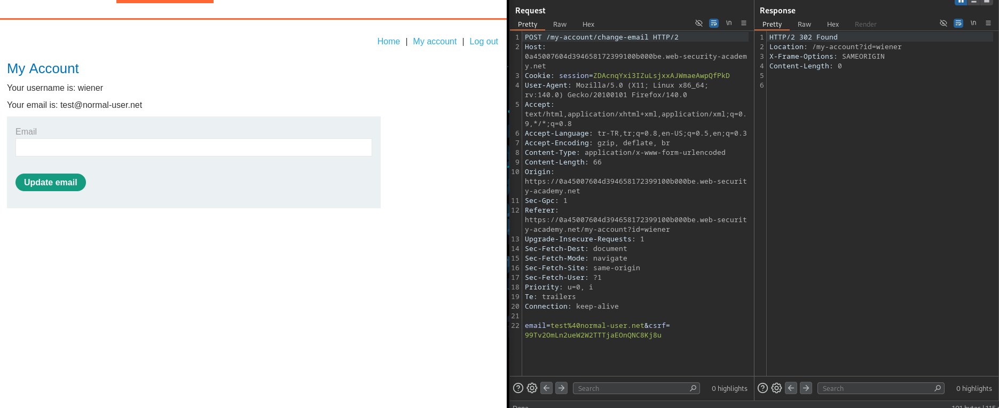
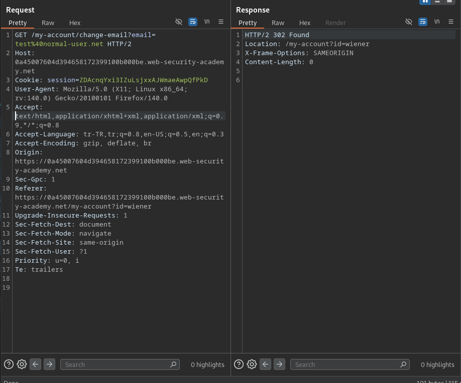
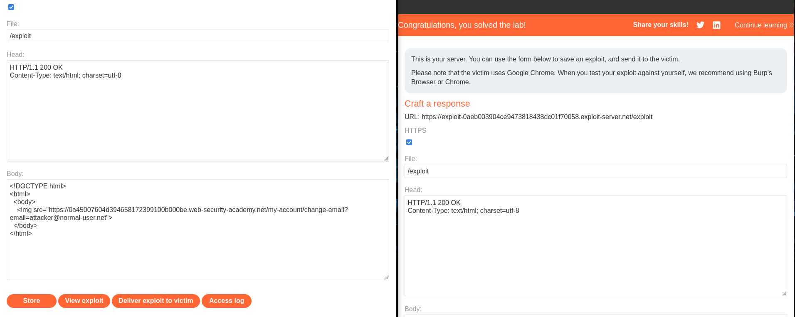

# Lab: CSRF where token validation depends on request method

## Lab Description

This lab's email change functionality is vulnerable to CSRF. It attempts to block CSRF attacks, but only applies defenses to certain types of requests.

To solve the lab, use your exploit server to host an HTML page that uses a CSRF attack to change the viewer's email address.

You can log in to your own account using the following credentials: wiener:peter 

---

## Step 1 — Analyze Email Change Functionality (POST Request)

After logging in as a valid user, the email change functionality was tested
using the account settings page.

The email update request was captured using Burp Suite.
The request uses the POST method and includes a CSRF token parameter.

This indicates that the application attempts to protect the functionality
against CSRF attacks for POST requests.

---

## Step 2 — Identify CSRF Token Validation Based on Request Method

The email change request was modified to use the GET method instead of POST.
The CSRF token parameter was completely removed.

Despite the absence of a CSRF token, the server accepted the request
and updated the email address successfully.

This demonstrates that CSRF validation is only enforced for POST requests,
while GET requests remain unprotected.

---

## Step 3 — Exploit CSRF via GET Request

Since the application does not enforce CSRF validation for GET requests,
a malicious HTML page was crafted to exploit this behavior.

The exploit uses an image tag to trigger a GET request automatically
when the page is loaded by the victim:

<!DOCTYPE html>
<html>
  <body>
    
  </body>
</html>

The HTML page was hosted on the exploit server and executed in the victim’s browser.
As a result, the victim’s email address was changed without their consent,
successfully solving the lab.

---