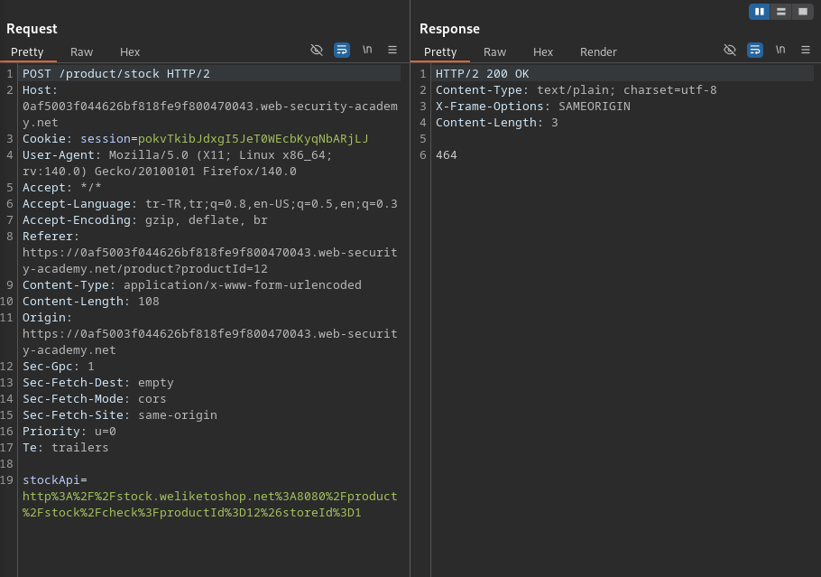
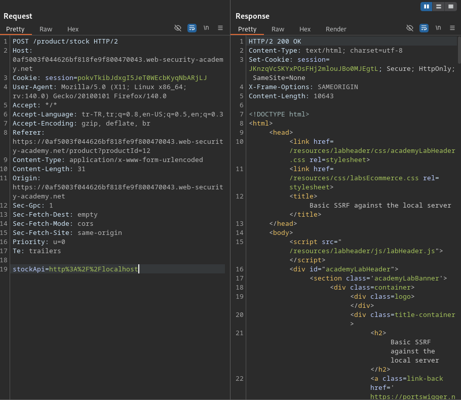
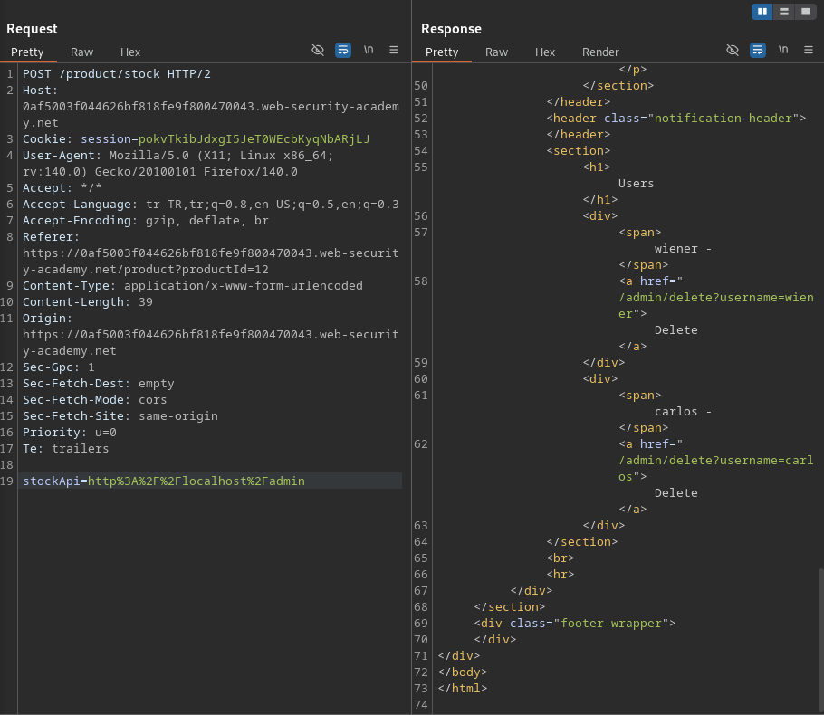
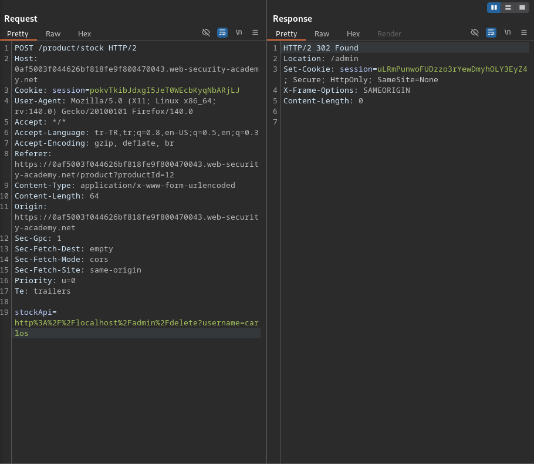

# Lab: Basic SSRF against the local server

## Lab Description
This lab has a stock check feature which fetches data from an internal system.

To solve the lab, change the stock check URL to access the admin interface at http://localhost/admin and delete the user carlos.

---

## Step 1 — Analyze Stock Check Functionality

The application includes a stock check feature that retrieves inventory
information for products.

When the stock check button was used, the request was intercepted using
Burp Suite. The request contains a `stockApi` parameter, which specifies
a URL that the server fetches data from.

This behavior indicates that the application makes a server-side request
based on user-controlled input.

---

## Step 2 — Identify Server-Side Request Forgery

The `stockApi` parameter was modified to point to an internal address.

The request was sent with the following value:

http%3A%2F%2Flocalhost

The server processed the request and returned a response, confirming
that the application can be abused to make server-side requests to
internal resources.

This confirms the presence of a Server-Side Request Forgery (SSRF)
vulnerability.

---

## Step 3 — Access Internal Admin Interface

After confirming SSRF, the internal admin interface was targeted by
updating the `stockApi` parameter to the following URL:

http%3A%2F%2Flocalhost%2Fadmin

The server returned the admin interface, which is intended to be accessible
only from the internal network.

This demonstrates that SSRF can be used to access internal-only services.

---

## Step 4 — Delete the User via SSRF

The admin interface revealed a function to delete users.
The following URL was used to delete the user `carlos`:

http%3A%2F%2Flocalhost%2Fadmin%2Fdelete?username=carlos

By supplying this URL via the `stockApi` parameter, the server performed
the request internally and deleted the target user.

As a result, the lab was successfully solved.

