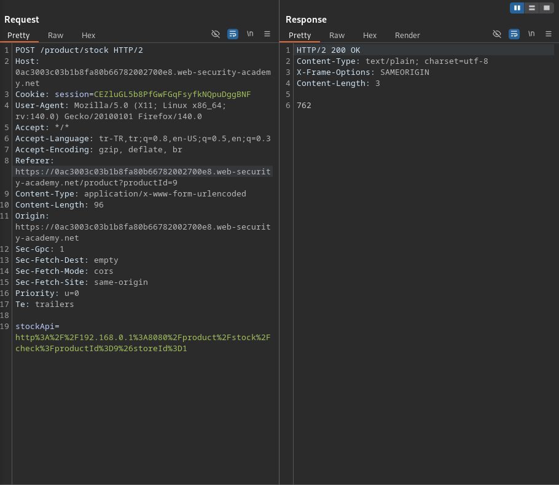
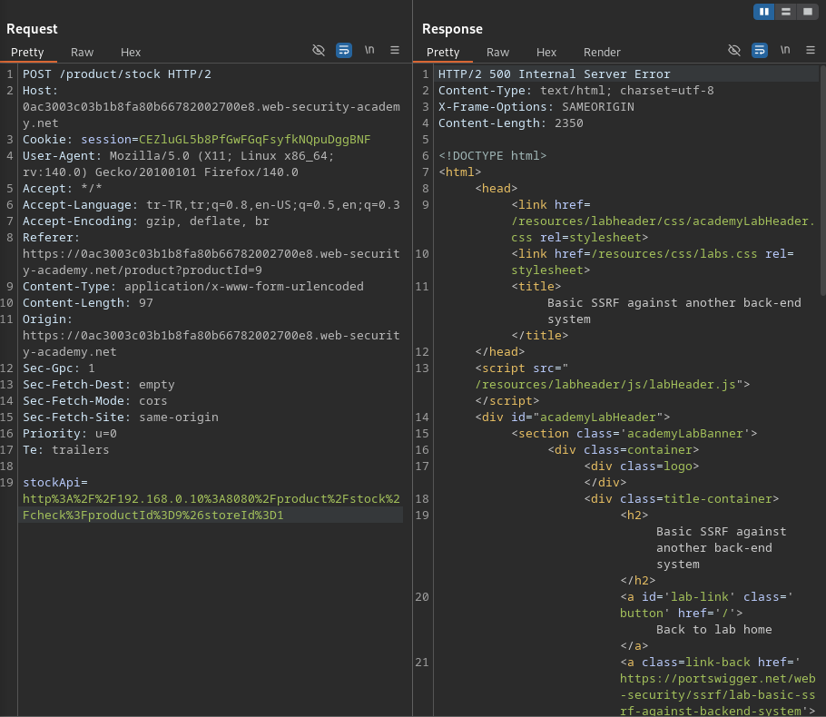
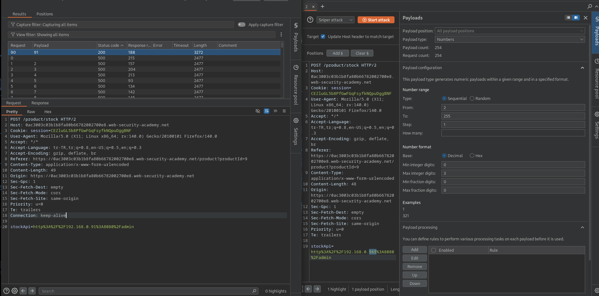
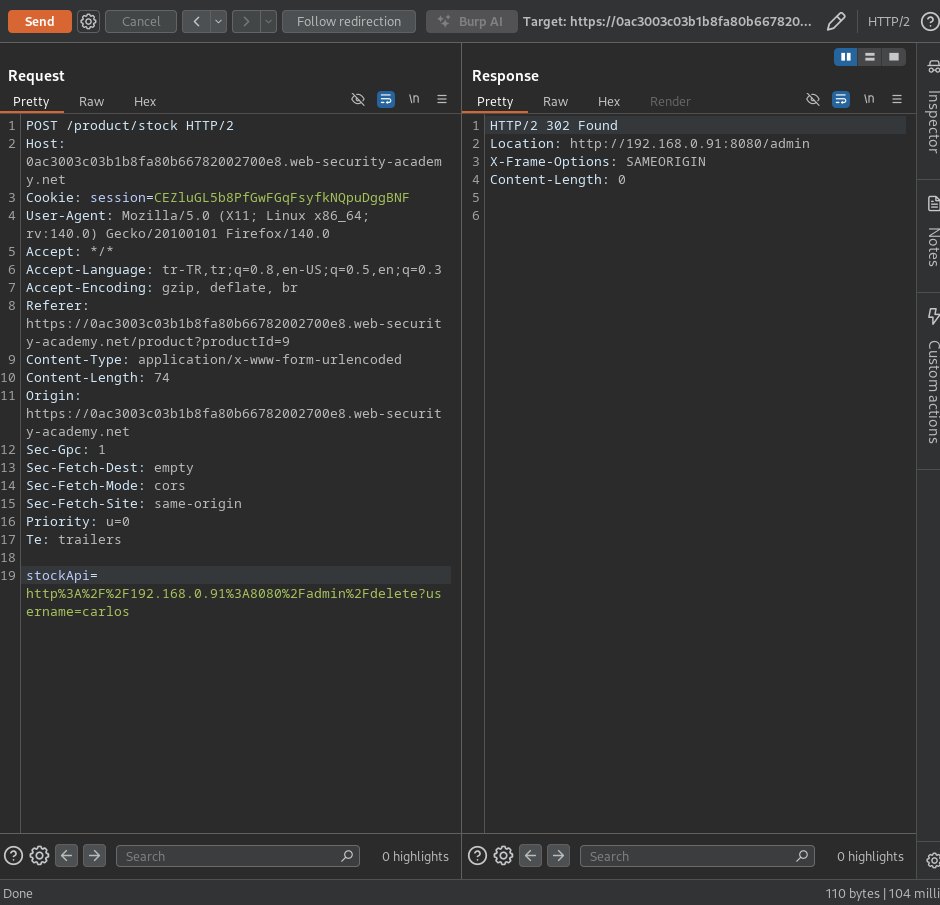

# Lab: Basic SSRF against another back-end system

## Lab Description
This lab has a stock check feature which fetches data from an internal system.

To solve the lab, use the stock check functionality to scan the internal 192.168.0.X range for an admin interface on port 8080, then use it to delete the user carlos. 

---

## Step 1 — Analyze Stock Check Functionality

The product page contains a Check stock feature that sends a request
to retrieve stock information.

The request was captured using Burp Suite.
The stockApi parameter contains a URL pointing to an internal IP address.

Example request:

stockApi=http://192.168.0.1:8080/product/stock/check?productId=1&storeId=1

This indicates that the application fetches data from an internal backend
system based on user-controlled input.

---

## Step 2 — Confirm SSRF Vulnerability

To confirm the presence of an SSRF vulnerability, the internal IP address
in the stockApi parameter was modified.

Different IP addresses in the 192.168.0.X range were tested.
The server responded differently depending on the target IP,
confirming that the application is making server-side requests
to internal systems.

This behavior confirms the existence of a Server-Side Request Forgery (SSRF)
vulnerability.

---

## Step 3 — Enumerate Internal Network Using Burp Intruder

After confirming the SSRF vulnerability, Burp Intruder was used
to enumerate the internal network and locate the admin interface.

The stockApi parameter was selected as the attack vector,
and the internal IP address was marked as a payload position.

Example base request:

stockApi=http%3A%2F%2F192.168.0.§6§%3A8080%2Fadmin

Intruder Configuration

Attack type: Sniper

Payload position: Last octet of the IP address (192.168.0.X)

Payload type: Numbers

Payload range: 2 to 255

By analyzing the responses, one IP address returned a 200 OK response
with a noticeably larger response length, indicating the presence
of an internal admin interface.

---

## Step 4 — Access Admin Interface and Delete User

After identifying the internal IP address hosting the admin interface,
the request was modified to directly interact with it.

The following request was sent via the vulnerable stockApi parameter
to delete the user carlos:

stockApi=http%3A%2F%2F192.168.0.91%3A8080%2Fadmin%2Fdelete?username=carlos

The server accepted the request, and the user carlos was successfully deleted.

This confirms that the SSRF vulnerability can be exploited
to perform privileged administrative actions on internal services.

