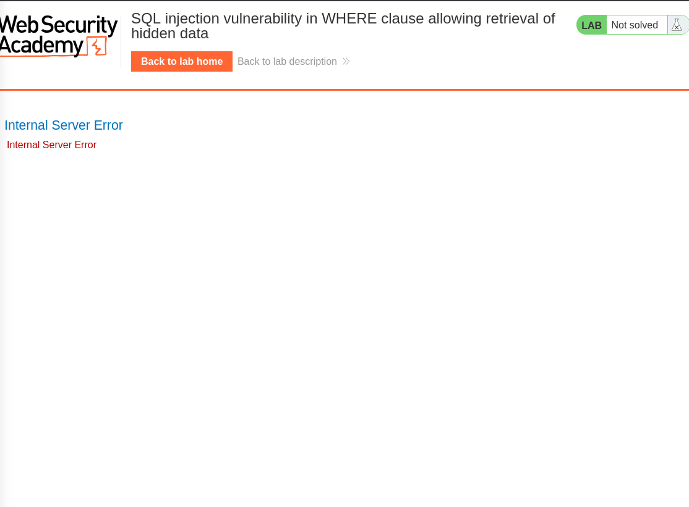
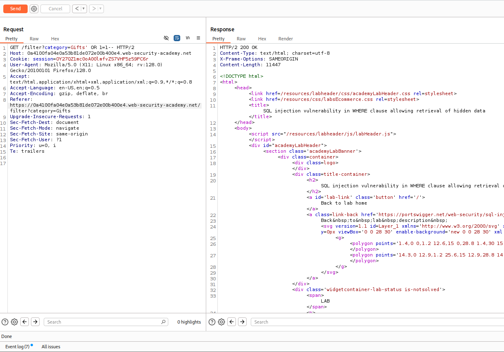
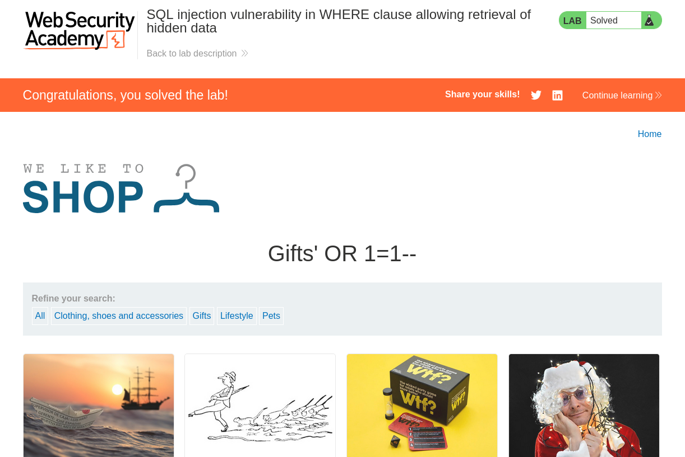

# Lab: SQL injection vulnerability in WHERE clause allowing retrieval of hidden data

## Lab Description
This lab contains a SQL injection vulnerability in the product category filter.
When a user selects a category, the application executes the following SQL query:

SELECT * FROM products WHERE category = 'Gifts' AND released = 1

## Step 1 — Identify the Injection Point
Navigate to the product list
Click on any category filter (e.g., Gifts)

Observe the URL parameter:
/filter?category=Gifts

This confirms that the category parameter is reflected in the request.

## Step 2 — Intercept with Burp Suite
Configure browser to use Burp Proxy (127.0.0.1:8080)
Open Burp → Proxy → Intercept (ON)
Reload the category filter page
Observe the request in Burp:

GET /filter?category=Gifts HTTP/2
Host: 0a4100fa04e0a53b81de072e00b400e4.web-security-academy.net

Confirmed: Request is captured successfully

## Step 3 — Test for SQL Injection
Send the request to Repeater in Burp
Modify the category parameter by adding a single quote ':

category=Gifts'

Send the request

Result:
Status code: 500 Internal Server Error
Response shows SQL syntax error

A single quote breaks the SQL query syntax, which indicates that
user input is directly concatenated into the SQL statement.

Screenshots:

This confirms the parameter is vulnerable to SQL injection

## Step 4 — Exploit the SQL Injection Vulnerability

After confirming that the `category` parameter is vulnerable, the next step
is to bypass the `released = 1` condition in the SQL query.

### Payload Used
Gifts' OR 1=1--

This payload modifies the original query logic:

SELECT * FROM products WHERE category = 'Gifts' OR 1=1--' AND released = 1

OR 1=1 forces the condition to always evaluate as true
-- comments out the remaining part of the query

## Result
HTTP Status Code: 200 OK

The application displays all products, including unreleased items
The lab is marked as Solved

## Evidence
Burp Suite Repeater — Successful Exploit
Web Application — Unreleased Products Displayed

