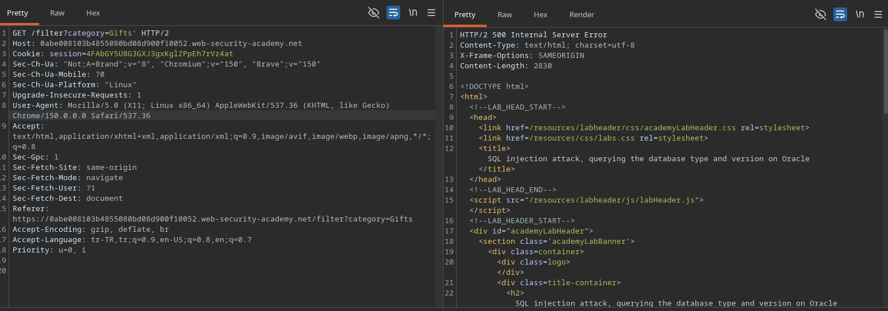

# Lab: SQL injection attack, querying the database type and version on Oracle

## Lab Description
This lab contains a SQL injection vulnerability in the product category filter. You can use a UNION attack to retrieve the results from an injected query.

The objective is to exploit the SQL injection flaw to query the database type and version on Oracle, displaying the database version string to solve the lab.

---

## Step 1 — Intercept the Category Filter Request
Navigate to the application home page and select any product category filter (e.g., `Gifts`) to generate a filtered request.

Capture this HTTP `GET` request using Burp Suite and send it to the Repeater instrument for manual analysis.

### Example Base Request
GET /filter?category=Gifts HTTP/2
Host: 0abe008103b4855080bd08d900f10052.web-security-academy.net

---

## Step 2 — Identify SQL Injection Vulnerability
To test whether the `category` parameter interacts directly with the database backend, a single quote character (`'`) was appended to the input value.

### Modified Request
GET /filter?category=Gifts' HTTP/2
Host: 0abe008103b4855080bd08d900f10052.web-security-academy.net

### Result
* **HTTP Status Code:** 500 Internal Server Error
* **Response:** The application broke and threw an "Internal Server Error" message, confirming unvalidated parameter interpolation into the database query logic.

### Screenshots

---