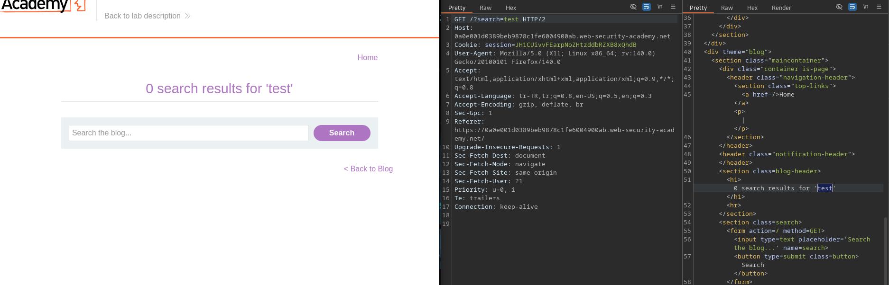
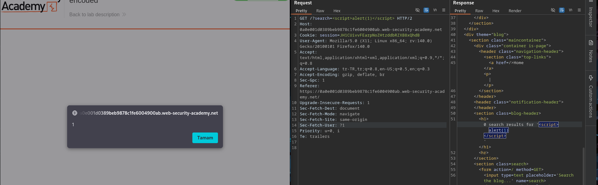

# Lab: Reflected XSS into HTML context with nothing encoded

## Lab Description

This lab contains a simple reflected cross-site scripting (XSS) vulnerability
in the search functionality.

The application reflects user input directly into the HTML response
without any encoding.

To solve the lab, a JavaScript payload calling the `alert()` function
must be injected.

---

## Step 1 — Identify the XSS Vulnerability

Navigate to the lab page and locate the search functionality.
Enter a simple test value into the search input:

After submitting the search request, the application reflects the user input
directly inside the HTML response without applying any encoding.
This behavior indicates a reflected XSS vulnerability in the search feature.

---

## Step 2 — Exploit Reflected XSS

After confirming that the search parameter is reflected without encoding,
the request was modified to inject a JavaScript payload.

The following payload was used:

The payload was reflected directly into the HTML response and executed
by the browser, triggering a JavaScript alert.

As a result, the lab was successfully solved.

