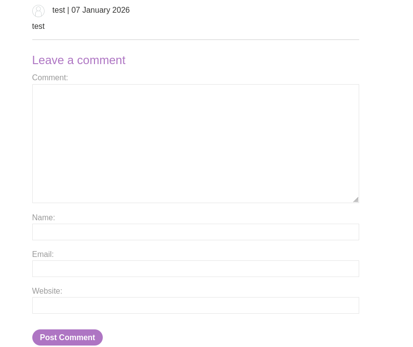
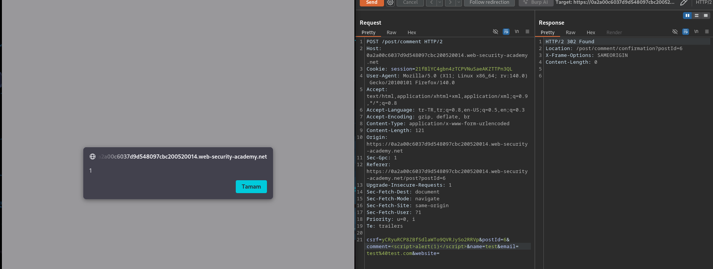

# Lab: Stored XSS into HTML context with nothing encoded

## Lab Description

 This lab contains a stored cross-site scripting vulnerability in the comment functionality.

To solve this lab, submit a comment that calls the alert function when the blog post is viewed. 

---

## Step 1 — Identify Stored Input in Comment Functionality

Navigate to a blog post and locate the comment submission form.
Submit a benign test comment to observe how user input is handled.

After submitting the comment, the input is displayed on the blog post
and remains visible after refreshing the page.
This confirms that user-supplied data is stored and rendered persistently.

---

## Step 2 — Exploit Stored XSS via Burp Suite

After confirming that user input is stored and rendered persistently,
the comment submission request was intercepted and modified using Burp Suite.

The `comment` parameter was updated with the following payload:

The modified request was then sent to the server.
When the blog post was viewed, the injected script was executed automatically,
triggering a JavaScript alert.

This demonstrates a stored cross-site scripting vulnerability,
as the payload is saved on the server and executed for every user
who visits the affected blog post.

